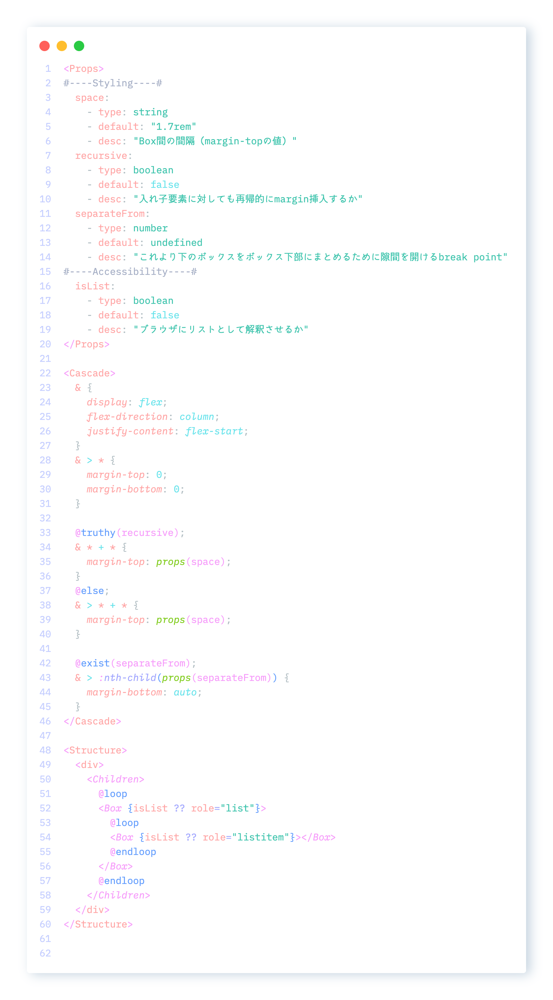
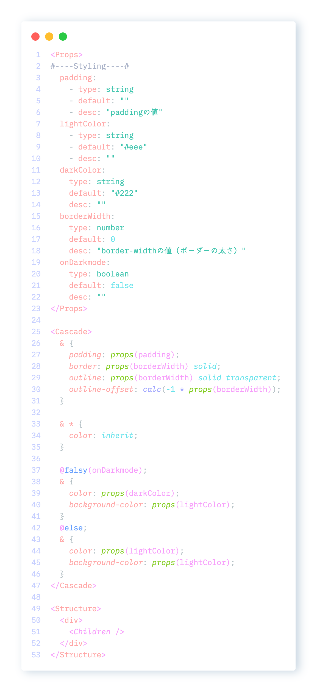
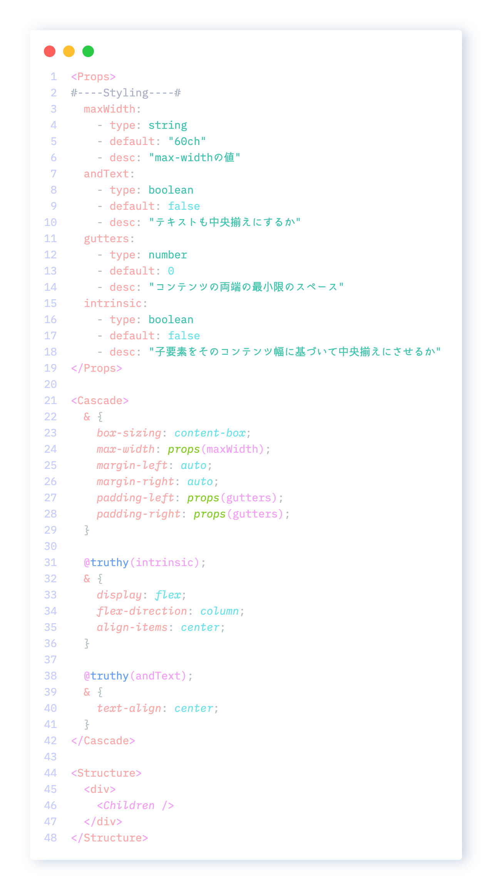
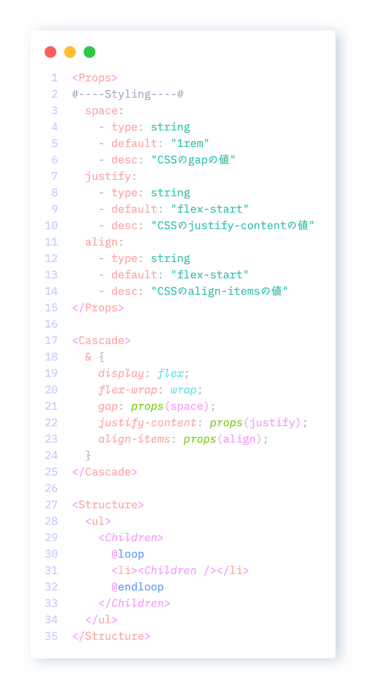
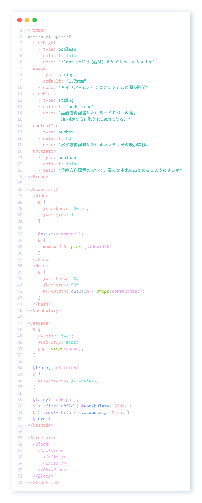
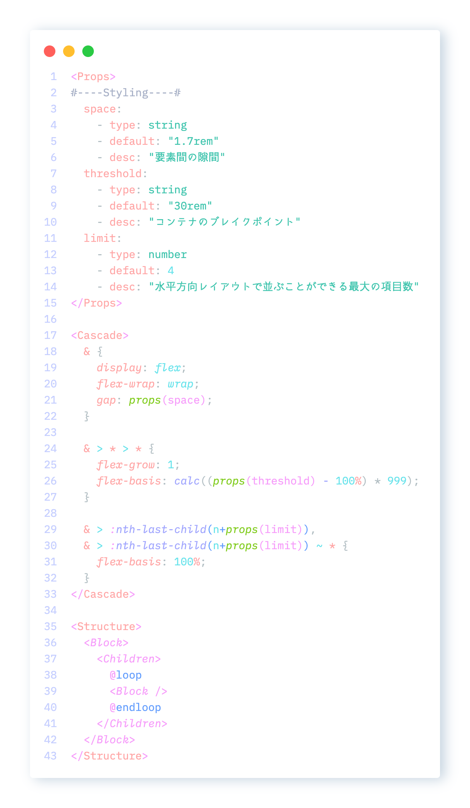

# Classification Concept

All components are built on **Base**.

All design is built on **Accessibility**.

- **Layout** - building Flexibility
  - Layout Pattern
- **Impression** - building Impressions
  - Utility Motion
  - Ornament
  - Customize Style
- **Operation** - building Operability
  - Navigation
  - Form
  - Trigger Object
  - Guiding Object
- **Content** - building Readability
  - Readable Marker
  - Media
  - Data Visualization
- **Prototype** - building Applications
  - CRUD
  - System

# Layout -> Layout Pattern

Package name is **Layout**

## Stack

**Stack** implementation of Every Layout

## Card

**Box** implementation of Every Layout

## Center

**Center** implementation of Every Layout

## Cluster

**Cluster** implementation of Every Layout

## LayAside

**Sidebar** implementation of Every Layout

## Switcher

**Switcher** implementation of Every Layout

## Cover

**Cover** implementation of Every Layout

# Impression -> Utility Motion

## Animation

### Provided css-props

[CSSAnimations](../../core/classified-csstypes/lib/cssdata/byModule/CSSAnimations.json)
[CSSMotionPath](../../core/classified-csstypes/lib/cssdata/byModule/CSSMotionPath.json)
[CSSTransitions](../../core/classified-csstypes/lib/cssdata/byModule/CSSTransitions.json)

## Scroll

### Provided css-props

[CSSOMView](../../core/classified-csstypes/lib/cssdata/byModule/CSSOMView.json)
[CSSScrollAnchoring](../../core/classified-csstypes/lib/cssdata/byModule/CSSScrollAnchoring.json)
[CSSScrollSnap](../../core/classified-csstypes/lib/cssdata/byModule/CSSScrollSnap.json)
[CSSScrollbars](../../core/classified-csstypes/lib/cssdata/byModule/CSSScrollbars.json)

# Impression -> Ornament

# Impression -> Customize Style

# Operation -> Navigation

# Operation -> Form

### Provided css-props

[CSSBasicUserInterface](../../core/classified-csstypes/lib/cssdata/byModule/CSSBasicUserInterface.json)

# Operation -> Trigger Object

# Operation -> Guiding Object

# Content -> Readable Marker

## Ruby

### Provided CSS-props

[CSSRuby](../../core/classified-csstypes/lib/cssdata/byModule/CSSRuby.json)

## List

### Provided CSS-props

[CSSListsandCounters](../../core/classified-csstypes/lib/cssdata/byModule/CSSListsandCounters.json)

# Content -> Media

## Image

### Provided CSS-props

[CSSImages](../../core/classified-csstypes/lib/cssdata/byModule/CSSImages.json)

# Content -> Data Visualization

## Table

### Provided CSS-props

[CSSTable](../../core/classified-csstypes/lib/cssdata/byModule/CSSTable.json)

# Prototype -> CRUD

# Prototype -> System
